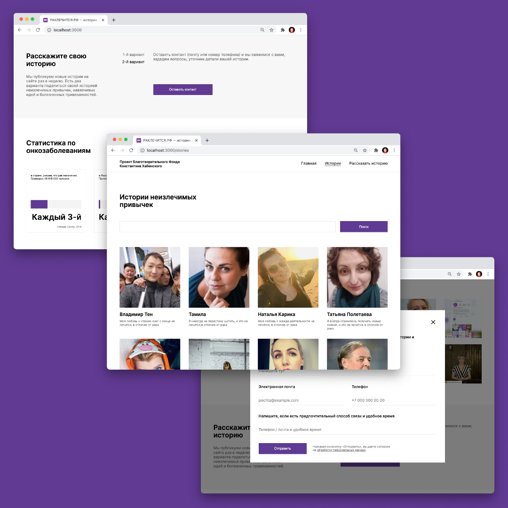

# raklechitsa / Рак Лечится




## Проект для НКО "Рак лечится"

[Яндекс.Практикум](https://praktikum.yandex.ru/web) и проект ["Рак лечится"](https://raklechitsa.ru) благотворительного Фонда Константина Хабенского, предложили студентам Яндекс.Практикума участие в разработке фронтенд части сайта "Рак лечится".  

В течении 4 недель необходимо было освоить новый стек (Vue.js, Nuxt.js, Vuex), навыки командной работы, сверстать с учётом адаптивности (по макету в Figma), реализовать клиентскую бизнес-логику сайта и задействовать готовый REST API с данными.


## Результат:

Из 22 команд только 8 команд реализовали необходимый функционал. Наша команда оказалась среди них.

Самое важное — впервые был получен опыт командной разработки и использования таких сервисов как GitHub и Trello для достижения данной цели.

[Рекомендательное письмо (.pdf)](./doc/assets/rek_pismo_komanda_sergeya_mukhina_raklechitsa.pdf)


## Если не работает...

Путь к API указывается в файле `.env` (необходимо создать в корне проекта):

```
BASE_URL=https://strapi.kruzhok.io
```

| :confused: Проект использует временное REST API. К сожалению в любое время его могут отключить и мы не можем повлиять на это. |
| --- |  


## Наша команда: 

Сергей Мухин — https://github.com/mukhindev  
Александр Меньщиков — https://github.com/AleksandrMenshchikov  
Булат Хабибуллин — https://github.com/foxoter  
Александра Филимонова — https://github.com/SanFili  
Андрей Волков — https://github.com/AndreyVolkov88  


## Наставник и ревьювер проекта:

Большое спасибо Хазу Байкулову за наставления в проекте и проделанные ревью.  
Хаз Байкулов — https://github.com/spacehaz  

---
2020 г.

